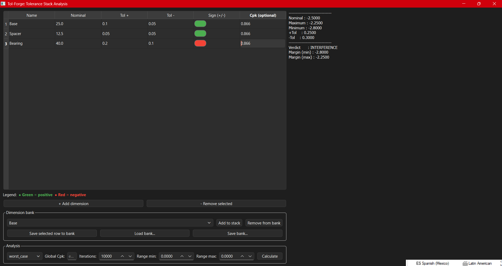
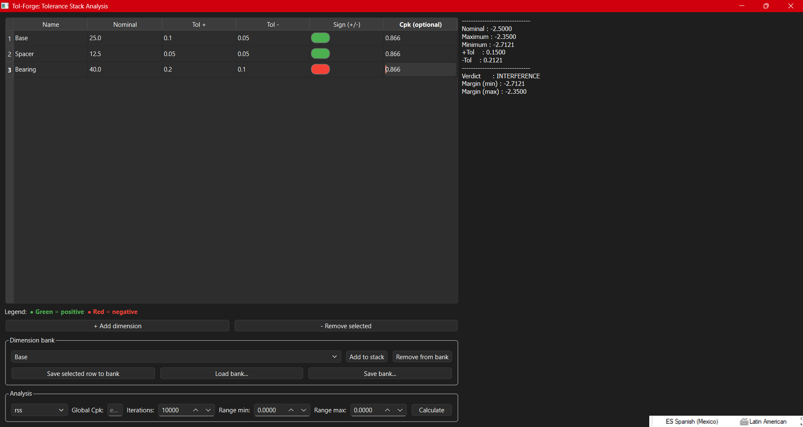
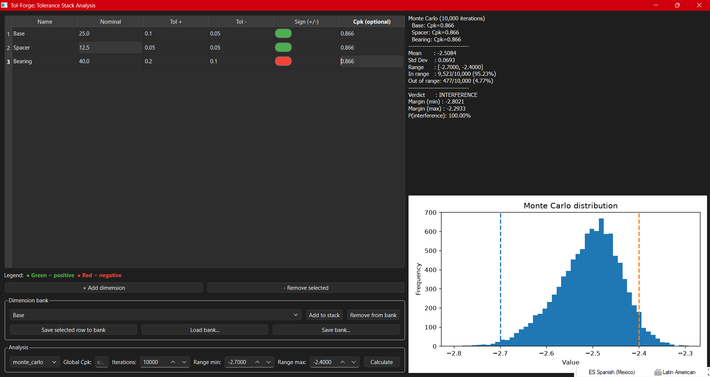

# TolForge

TolForge is a desktop-first tolerance stack-up analysis tool for Worst Case,
RSS, and Monte Carlo studies. It combines a PySide6 GUI with a reusable
Python backend so you can build a dimension chain, compare methods, and
inspect the Monte Carlo distribution without writing code.

## Structure

```
Code/
├── tolstack/
│   ├── __init__.py     # Public package API
│   ├── models.py       # Dimension and result models
│   └── stack.py        # Stack calculation logic
├── examples/
│   └── basic_usage.py  # Console example
├── gui/
│   └── app.py          # Desktop GUI
└── main.py            # Quick console entry point
```

## Installation

```bash
git clone https://github.com/JACHmecha/TolForge.git
cd TolForge
pip install -r requirements.txt
```

To launch the desktop app:

```bash
python Code/gui/app.py
```

## Packaging and distribution

### Windows executable

The repository includes a PyInstaller spec file and a helper script for
building a single-file Windows executable.

```powershell
Set-ExecutionPolicy -Scope Process -ExecutionPolicy Bypass
.\build_installer.ps1
```

This produces a bundled app at `dist/TolForge.exe`.

You can also build it directly with:

```powershell
python -m PyInstaller --noconfirm --clean --distpath dist --workpath build TolForge.spec
```

### GitHub release automation

A GitHub Actions workflow is included to build the Windows executable when a
release is published and upload it as a release asset.

## Usage

### Desktop GUI

```bash
python Code/gui/app.py
```

The GUI lets you build and analyze a tolerance chain from a table of
rows, then compare the result against a target using one of three methods.

Key features:
- Editable rows for name, nominal, tolerance limits, sign, and optional Cpk.
- A sign toggle per row using a green/red switch for positive/negative
  contribution.
- A legend describing the green/red sign state.
- A dimension bank for saving reusable templates and loading/saving bank
  data as JSON.
- Analysis controls for `worst_case`, `rss`, or `monte_carlo`, plus a
  global Cpk fallback and target-based fit assessment.
- Monte Carlo interval analysis with draggable vertical guides, configurable
  iteration count, and in-range/out-of-range percentages.

Worst Case and RSS show deterministic summary values. Monte Carlo also
renders a histogram of the resulting distribution and summarises the
interval coverage.

### Monte Carlo model per dimension

- Empty `Cpk` cell → uniform sampling across the full tolerance range.
- `Cpk` cell with a value (for example `1.33`) → split-normal sampling,
  calibrated so the tolerance limit sits at $3 \times Cpk$ standard deviations
  from nominal.
- Global `Cpk` field → applies that value to any dimension without its own
  Cpk entry.

The Monte Carlo summary explicitly lists which model was used for each
row, so the assumption behind the histogram is always visible.

> **Note:** the three tolerance methods produce different bounds from the
> same input stack. That spread — Worst Case vs. RSS vs. Monte Carlo — is
> the value of using more than one analysis method.

| Worst Case | RSS | Monte Carlo |
|---|---|---|
|  |  |  |

### Console

```bash
python Code/main.py
python Code/examples/basic_usage.py
```

### As a library

```python
from tolstack import Stack, Dimension

stack = Stack()
stack.add_dimension(Dimension(name="Base", nominal=25.0, tol_plus=0.10, tol_minus=0.05, sign="+"))
stack.add_dimension(Dimension(
    name="Bearing", nominal=40.0, tol_plus=0.20, tol_minus=0.10, sign="-", cpk=1.33
))

stack.summary(method="rss")  # or "worst_case" / "monte_carlo"
```

## Notes

- The backend now uses `+` and `-` sign values consistently.
- Monte Carlo sampling now supports both uniform and split-normal behavior.
- The GUI has been updated for easier sign editing, clearer results, and
  interval-focused Monte Carlo inspection.

Apache License 2.0 — see [LICENSE](LICENSE).
